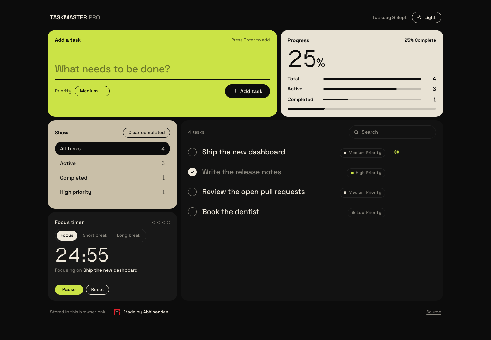
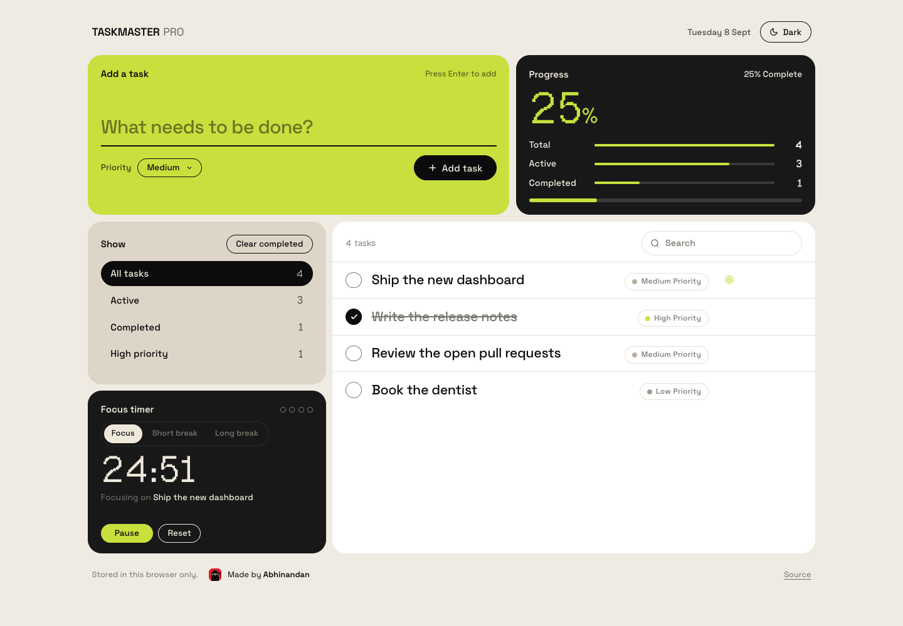
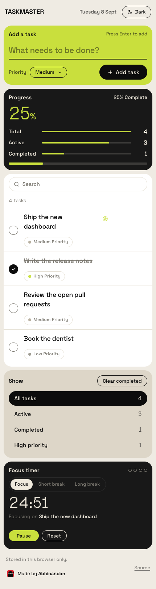

# TaskMaster Pro

A jQuery task manager laid out as a dashboard of colour blocks: add tasks with a priority, filter them with live counts, search with highlighting, edit inline, and run a Pomodoro focus timer that counts sessions against the task you link it to. Everything is stored in the browser and survives a reload.

**Live:** https://abhinandansharma.github.io/taskMasterPro/



## What it does

- **Add and edit.** One big input, Enter to add, double-click a task (or the pencil) to edit it in place.
- **Priorities.** High, medium and low, shown as a dot on each task.
- **Filters with counts.** All, active, completed and high priority, each with a live number.
- **Search.** Type in the list header and matches are highlighted; Escape clears.
- **Progress.** Total, active and completed as bars, plus the completion figure set large.
- **Focus timer.** 25-minute focus sessions with 5-minute breaks and a 15-minute break every fourth session. Use the target on a task to link it; finished sessions are counted on that task, a chime plays, and the tab title shows the countdown.
- **Two themes.** Dark by default, light with one dark panel. The choice is remembered.
- **Keyboard.** Enter adds a task, Escape clears the search, Space starts or pauses the timer.

## Light mode



## On a phone



## Stack

Plain HTML, CSS and jQuery 3.5. No build step. Space Grotesk for text and [Geist Pixel](https://vercel.com/font) (Square) for the numerals, self-hosted. Tasks live in `localStorage` under `taskmaster.tasks`, the timer under `taskmaster.pomodoro`.

## Run it locally

Clone the repository and open `index.html`, or serve the folder:

```bash
python3 -m http.server 4000
# http://localhost:4000
```

## License

MIT. Geist Pixel is licensed under the SIL Open Font License, see `assets/fonts/GEIST-LICENSE.txt`.

Built by [Abhinandan Sharma](https://abhinandansharma.github.io/portfolio/).
